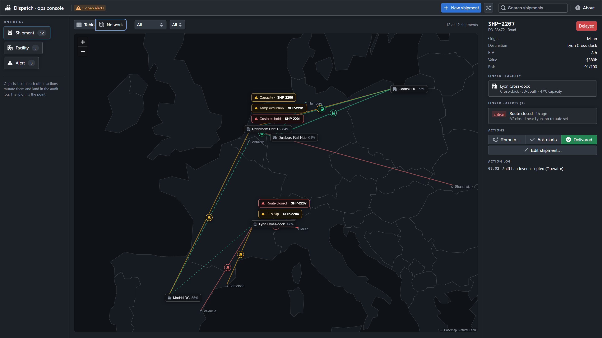

# Dispatch — a tiny ops console built with Palantir's Blueprint

An evening project: a logistics operations console built with
[Blueprint](https://github.com/palantir/blueprint), Palantir's open-source
React toolkit for data-dense interfaces.

I built it while preparing to talk to Palantir about a Forward Deployed
Software Engineer role. Reading about Foundry and AIP, the idea that stuck
with me was the ontology: real-world things modeled as **objects**, connected
by **links**, changed through auditable **actions**. The fastest way to
understand an idiom is to build in it — so this app models a miniature
version of exactly that:

- **Objects** — shipments, facilities, alerts (fictional data)
- **Links** — a shipment's destination facility, its alerts
- **Actions** — *Reroute*, *Acknowledge alerts*, *Mark delivered*, plus
  creating and editing shipments through a form (with a Randomize helper) —
  named mutations that land in an action log, not ad-hoc edits

The same objects render in two views: a table and a **Network** map
(Leaflet over a flat Natural Earth vector base — no tiles, no keys)
where shipments are risk-colored routes between labeled origin cities
and facility pins, and open alerts float as callouts. Selecting or
mutating an object in one view updates the other — one state, two
projections.




## Run

```bash
npm install
npm run dev
```

## Notes

- UI: `@blueprintjs/core` v6 (dark theme), Vite + React.
- All data is local and fictional; there is no backend on purpose —
  the modeling idiom is the point.
- Not affiliated with Palantir. Blueprint is their open-source UI toolkit.

— Daniil Lutsyk
